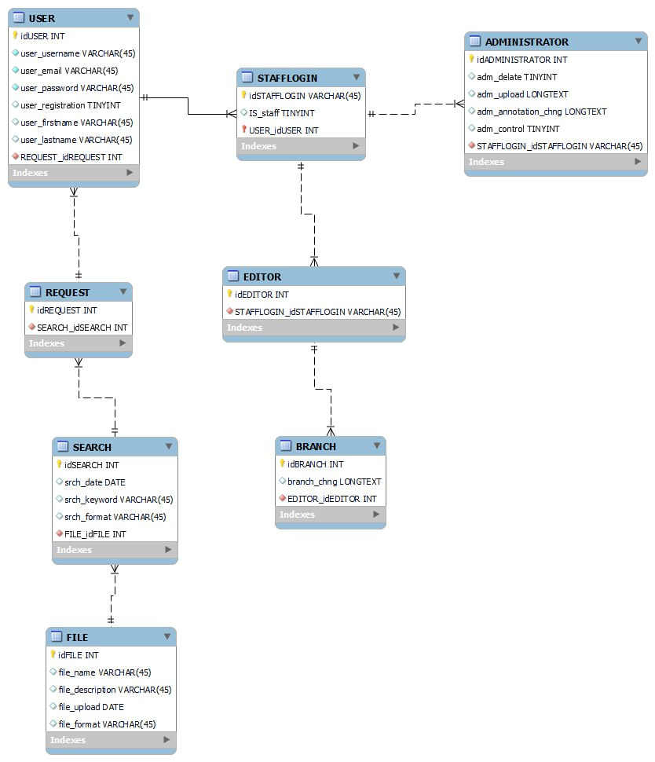

# Проєктування бази даних

В рамках проекту розробляється: 
модель бізнес-об'єктів

@startuml
entity User <<ENTITY>> #CCFFFF
entity User.id <<NUMBER>> #FFFFFF
entity User.username <<TEXT>> #FFFFFF
entity User.firstname <<TEXT>> #FFFFFF
entity User.lastname <<TEXT>> #FFFFFF
entity User.email <<TEXT>> #FFFFFF
entity User.password <<TEXT>> #FFFFFF

entity Role <<ENTITY>> #CCFFFF
entity Role.id <<NUMBER>> #FFFFFF
entity Role.name <<TEXT>> #FFFFFF

entity Access <<ENTITY>> #CCFFFF
entity Access.id <<NUMBER>> #FFFFFF

entity Datafile <<ENTITY>> #CCFFFF
entity Datafile.id <<NUMBER>> #FFFFFF
entity Datafile.name <<TEXT>> #FFFFFF
entity Datafile.content <<TEXT>> #FFFFFF
entity Datafile.description <<TEXT>> #FFFFFF
entity Datafile.format <<TEXT>> #FFFFFF
entity Datafile.date <<NUMBER>> #FFFFFF

entity Tag <<ENTITY>> #CCFFFF
entity Tag.name <<TEXT>> #FFFFFF

entity Link <<ENTITY>> #CCFFFF

User *-u- User.id
User *-u- User.username
User *-u- User.firstname
User *-u- User.lastname
User *-u- User.email
User *-u- User.password

Role *-d- Role.id
Role *-d- Role.name

Access *-d- Access.id

Datafile *-d-- Datafile.id
Datafile *-d-- Datafile.name
Datafile *-d-- Datafile.content
Datafile *-d-- Datafile.date
Datafile *-d-- Datafile.description
Datafile *-d-- Datafile.format

Tag *-u- Tag.name

User "0,*"-d-"1,1" Role

User "1,1"-r-"0,*" Access

Access "0,*"-r-"1,1" Datafile

Datafile "1,1"-r-"0,*" Link
Link "0,*"-r-"1,1" Tag

@enduml

ER-модель

@startuml  
entity User <<ENTITY>>{ 
User.id:NUMBER 
User.username:TEXT 
User.email:TEXT 
User.password:TEXT 
User.firstname:TEXT 
User.lastname:TEXT 
} 
 
entity Stafflogin <<ENTITY>>{ 
Stafflogin.id:NUMBER 
} 
 
entity Role <<ENTITY>>{ 
Role.name:TEXT 
Role.id:NUMBER 
} 
 
entity Access <<ENTITY>>{ 
Access.id:NUMBER 
} 
 
entity Datafile <<ENTITY>> { 
Datafile.id:NUMBER 
Datafile.name:TEXT 
Datafile.content:TEXT 
Datafile.description:TEXT 
Datafile.format:TEXT 
Datafile.date:NUMBER 
} 
 
entity Link <<ENTITY>>{ 
} 
   
entity Tag <<ENTITY>>{ 
Tag.name:TEXT 
} 
 
User"0,*" -- "1,1"Stafflogin 
Role"0,*" -- "1,1"Stafflogin 
User"1,1" -- "0,*"Access 
Access"0,*" -- "1,1"Datafile 
Datafile"1,1" -- "0,*"Link 
Link"0,*" -- "1,1"Tag 
@enduml

- реляційна схема

